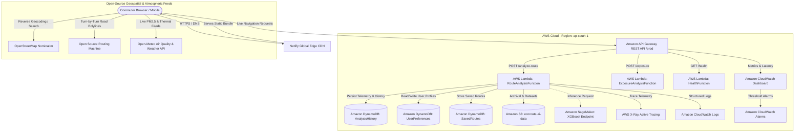

# 🌿 EcoRoute AI — System Architecture & Technical Specification

> **Navigate Smarter. Breathe Better.**  
> An AI-powered environmental navigation platform that models micro-climate exposure, predicts air pollution along travel corridors, and optimizes routes to minimize respiratory and thermal stress.

---

## 📑 Table of Contents
1. [Executive Summary & Problem Statement](#1-executive-summary--problem-statement)
2. [High-Level Architecture & System Topology](#2-high-level-architecture--system-topology)
3. [Full Technology Stack](#3-full-technology-stack)
4. [AWS Serverless Infrastructure Deep Dive](#4-aws-serverless-infrastructure-deep-dive)
5. [AI & Machine Learning Engine (Amazon SageMaker)](#5-ai--machine-learning-engine-amazon-sagemaker)
6. [Deterministic Environmental Scoring Engine](#6-deterministic-environmental-scoring-engine)
7. [Core Innovations & Feature Differentiators](#7-core-innovations--feature-differentiators)
8. [Data Models & API Specifications](#8-data-models--api-specifications)
9. [DevOps, Deployment & Hosting Pipeline](#9-devops-deployment--hosting-pipeline)
10. [Security, Reliability & Responsible AI](#10-security-reliability--responsible-ai)

---

## 1. Executive Summary & Problem Statement

### 1.1 The Blind Spot of Conventional Navigation
Contemporary navigation engines (e.g., Google Maps, Apple Maps, Waze) optimize exclusively for **time and distance**. They treat the ambient atmosphere as uniform and benign, ignoring:
- **Spatial Smog Disparity**: Particulate matter (PM2.5 / PM10) concentrations can fluctuate by 300% to 500% between adjacent parallel streets (e.g., heavily congested arterial corridors vs. canopy-covered residential corridors).
- **Thermal Heat Stagnation**: Urban heat islands and asphalt thermal radiance compound respiratory strain during peak daylight hours.
- **Micro-climate Vulnerabilities**: Children, asthmatics, daily bicycle commuters, and pedestrians face severe cumulative exposure risks that are never quantified.

### 1.2 The EcoRoute AI Solution
EcoRoute AI introduces an **environmental intelligence layer** on top of turn-by-turn road networks:
1. Analyzes multiple feasible route topologies between any origin and destination.
2. Dissects paths into distinct sub-kilometer road segments.
3. Attaches localized, real-time and predicted environmental vectors (PM2.5, PM10, temperature, heat index, tree canopy shade).
4. Produces transparent, deterministic composite exposure scores based on user priority (Cleanest, Coolest, Fastest, Balanced).
5. Provides **Departure Time Optimization** (e.g., *"Leaving 35 minutes later reduces PM2.5 exposure by 33%"*).
6. Activates **Only Practical Route Mode** when physical detours do not exist, providing hotspot mitigation tactics instead of dead-ends.

---

## 2. High-Level Architecture & System Topology

The platform implements a **decoupled, event-driven serverless architecture** that unites a globally distributed edge CDN frontend with scalable AWS cloud compute and ML services.



---

## 3. Full Technology Stack

### 3.1 Frontend Architecture
- **Framework**: React 19 SPA (Single Page Application)
- **Language**: TypeScript 5.8+ (Strict Type-Checking)
- **Build Tool**: Vite 8.3 (Rolldown minification, Hot Module Replacement)
- **Styling**: TailwindCSS v4 with semantic CSS variables for dark/light themes
- **Mapping & GIS**: Leaflet 1.9 & React-Leaflet 5.0 with custom vector icon pulses and Canvas polylines
- **Data Visualization**: Recharts 3.10 (Responsive diurnal area curves and radar charts)
- **Animation**: Framer Motion 14.0 (Micro-interactions, staggered card transitions)
- **Icons**: Lucide React & Google Material Symbols

### 3.2 Backend & Cloud Infrastructure
- **Compute**: AWS Lambda (Python 3.12 Runtime, ARM/x86_64 serverless execution)
- **API Management**: Amazon API Gateway (Regional REST API, CORS-enabled, Stage: `prod`)
- **Primary Database**: Amazon DynamoDB (NoSQL, On-Demand Capacity, TTL automatic expiration)
- **Object Storage**: Amazon S3 (AES-256 Server-Side Encryption, Versioning, Block Public Access)
- **Observability**: Amazon CloudWatch (Dashboards, Metric Alarms, Structured JSON Logging) & AWS X-Ray Tracing
- **Infrastructure as Code (IaC)**: AWS Serverless Application Model (AWS SAM) & AWS CloudFormation

### 3.3 Artificial Intelligence & Machine Learning
- **ML Engine**: Amazon SageMaker
- **Algorithm**: XGBoost Regression (Extreme Gradient Boosting)
- **Feature Pipeline**: Diurnal harmonics, rush-hour peak Gaussians, weekday penalization, thermal cross-correlation
- **Inference Target**: Hourly forecast of particulate matter ($\text{PM}_{2.5}$ in $\mu\text{g/m}^3$)

---

## 4. AWS Serverless Infrastructure Deep Dive

| AWS Service | Resource Identifier | Purpose & Technical Role |
| :--- | :--- | :--- |
| **Amazon API Gateway** | `EcoRouteApi` | Exposes REST endpoints (`/analyze-route`, `/exposure`, `/health`) with global CORS headers and CloudFront integration. |
| **AWS Lambda** | `EcoRoute-routeAnalysis` | Orchestrates multi-route environmental scoring, evaluates segment exposure, and logs telemetry. |
| **AWS Lambda** | `EcoRoute-exposureAnalysis` | Computes micro-level segment heat index, shade bonuses, and pollution source tagging. |
| **AWS Lambda** | `EcoRoute-health` | Sub-millisecond health probe validating end-to-end cloud operational status. |
| **Amazon DynamoDB** | `EcoRoute-UserPreferences` | Stores user travel modes (walking, cycling, EV, driving) and priority weights (`userId` HASH). |
| **Amazon DynamoDB** | `EcoRoute-SavedRoutes` | Archives bookmarked commuter corridors (`userId` HASH, `savedAt` RANGE). |
| **Amazon DynamoDB** | `EcoRoute-AnalysisHistory` | Tracks anonymized routing telemetry with automatic 30-day Time-To-Live (`ttl`) expiration. |
| **Amazon S3** | `ecoroute-ai-data-<account>` | Houses raw atmospheric feeds, cleaned training sets, and serialized ML model artifacts (`.tar.gz`). |
| **Amazon SageMaker** | `ecoroute-pm25-forecast` | Real-time endpoint hosting the trained XGBoost model for diurnal predictive curves. |
| **Amazon CloudWatch** | `EcoRoute-AI-Dashboard` | Visualizes real-time Lambda invocations, execution duration, and API Gateway error codes. |
| **Amazon CloudWatch** | `EcoRoute-LambdaErrors` | CloudWatch Alarm configured to trigger notifications if Lambda error count exceeds threshold. |

---

## 5. AI & Machine Learning Engine (Amazon SageMaker)

### 5.1 Problem Framing
Environmental navigation requires knowing what pollution will look like **at the time of commute**, not just what a sensor reported 2 hours ago. Air pollution exhibits distinct temporal patterns dictated by human traffic rhythms and atmospheric boundary layer height.

### 5.2 Model Architecture: XGBoost PM2.5 Forecaster
The predictive engine employs an **XGBoost Regressor** trained on diurnal environmental indicators:

```
Input Features [X]:
  ├── hour_of_day        (0 – 23, integer)
  ├── day_of_week        (0 – 6, integer)
  ├── is_weekday         (0 or 1, binary flag)
  ├── temperature        (°C, continuous)
  └── pm25_lag_1h        (Historical previous-hour PM2.5 concentration)

Target Label [y]:
  └── predicted_pm25     (µg/m³, continuous)
```

### 5.3 Diurnal Peak Gaussian Formulation
The model captures non-linear rush-hour surges:
$$\text{PM}_{2.5}(t) = \text{Base} + A_1 \cdot \exp\left(-\frac{(t - 8.5)^2}{2\sigma_1^2}\right) + A_2 \cdot \exp\left(-\frac{(t - 18.5)^2}{2\sigma_2^2}\right) + \beta \cdot T + \gamma \cdot \text{Weekday}$$

Where:
- $t = 8.5$: Morning rush-hour traffic crest (8:30 AM)
- $t = 18.5$: Evening rush-hour commuter peak (6:30 PM)
- $\beta \cdot T$: Thermal inversion penalty factor

### 5.4 SageMaker Training Pipeline (`ml/pm25_forecast/train.py`)
```bash
# Local training verification
python ml/pm25_forecast/train.py --model-dir ./output

# Upload artifacts to Amazon S3
aws s3 cp ./output/ s3://ecoroute-ai-data-522688056711/models/pm25-forecast-v1/ --recursive

# Create SageMaker Training Job via AWS CLI
aws sagemaker create-training-job --cli-input-json file://ml/pm25_forecast/training_job.json
```

---

## 6. Deterministic Environmental Scoring Engine

Unlike generative AI systems that hallucinate advice, EcoRoute AI relies on **deterministic, verifiable mathematical formulations** defined in [scoring.ts](file:///c:/Users/kisho/OneDrive/Desktop/envh/src/lib/scoring.ts).

### 6.1 Individual Exposure Metrics
1. **Air Pollution Exposure Score**:
   $$\text{AirScore} = \min\left(100, \text{round}\left(\frac{\text{PM}_{2.5}}{150} \times 100\right)\right)$$
2. **Thermal Heat Exposure Score**:
   $$\text{HeatScore} = \begin{cases} 
   0 & \text{if } T \le 22^\circ\text{C} \\
   100 & \text{if } T \ge 42^\circ\text{C} \\
   \text{round}\left(\frac{T - 22}{20} \times 100\right) & \text{otherwise}
   \end{cases}$$
3. **Tree Canopy Shade Bonus**:
   $$\text{ShadeBonus} = \text{round}(\text{ShadePercentage} \times 0.10)$$

### 6.2 Micro-Segment Composite Score
$$\text{SegmentScore} = \max\left(0, \text{round}\left(\text{AirScore} \times 0.55 + \text{HeatScore} \times 0.35 - \text{ShadeBonus}\right)\right)$$

### 6.3 Multi-Criteria Route Optimization Function
Each candidate route $R$ receives an overall index computed across weighted priorities:
$$\text{Score}(R) = w_{\text{time}} \cdot \text{Norm}(\text{Duration}) + w_{\text{air}} \cdot \overline{\text{Air}} + w_{\text{heat}} \cdot \overline{\text{Heat}} + w_{\text{shade}} \cdot (100 - \overline{\text{Shade}})$$

| Priority Profile | Time Weight ($w_{\text{time}}$) | Air Weight ($w_{\text{air}}$) | Heat Weight ($w_{\text{heat}}$) | Shade Weight ($w_{\text{shade}}$) |
| :--- | :---: | :---: | :---: | :---: |
| **Cleanest** *(Default Eco)* | 15% | **60%** | 15% | 10% |
| **Coolest** | 15% | 20% | **50%** | 15% |
| **Fastest** | **60%** | 20% | 15% | 5% |
| **Balanced** | 30% | 30% | 25% | 15% |

---

## 7. Core Innovations & Feature Differentiators

### 7.1 "Only Practical Route" Resilience Mode
When navigating across bridges, mountain corridors, or single expressways, alternative routes may not exist. Conventional routing fails here by providing no alternatives. EcoRoute AI automatically triggers **Only Practical Route Mode**:
- Identifies the exact segment hotspots where vehicular stagnation occurs.
- Explains root causes (e.g., *"Diesel truck idling near industrial junction"*).
- Suggests active mitigation measures (e.g., N95 mask guidance, cycling cadence adjustments).
- Evaluates departure time windows to cross the corridor during lower-density hours.

### 7.2 Departure Time Optimization Radar
The platform calculates exposure changes across $+30\text{m}$, $+60\text{m}$, and $+120\text{m}$ departure windows:
> *"Leaving 45 minutes later lowers estimated PM2.5 exposure by 33% due to traffic dispersion after peak evening rush hour."*

### 7.3 Multi-Modal Sensitivity Multipliers
- **Walking / Running**: $3.1\times$ inhalation duration factor (highest respiratory lung-intake).
- **Bicycle / E-Scooter**: $1.0\times$ baseline metabolic intake.
- **Enclosed Cabin (Car/Bus)**: $0.64\times$ vehicle filtration cabin reduction factor.

---

## 8. Data Models & API Specifications

### 8.1 API Gateway REST Contract (`POST /analyze-route`)
**Request Payload**:
```json
{
  "origin": "Rajajinagar, Bengaluru",
  "destination": "RV College of Engineering",
  "originCoords": { "lat": 12.9914, "lng": 77.5502 },
  "destinationCoords": { "lat": 12.9232, "lng": 77.4988 },
  "travelMode": "walking",
  "priority": "cleanest",
  "departureTime": "2026-10-11T12:00:00Z"
}
```

**Response Payload**:
```json
{
  "recommendedRouteId": "route-b",
  "isOnlyPracticalRoute": false,
  "routes": [
    {
      "id": "route-b",
      "name": "Route B – Green Corridor",
      "label": "recommended",
      "totalDistanceMeters": 3000,
      "totalDurationSeconds": 1320,
      "airScore": 31,
      "heatScore": 28,
      "shadeScore": 62,
      "overallExposureScore": 31,
      "exposureLevel": "low",
      "avgPm25": 31,
      "avgTemperature": 29,
      "hotspotCount": 0,
      "recommendationReason": [
        "Lowest estimated PM2.5 exposure (avg 31 µg/m³ vs 74 µg/m³)",
        "Passes through park zone with 85% shade coverage"
      ]
    }
  ],
  "departureTimeOptions": [
    { "label": "Now", "offsetMinutes": 0, "exposureScore": 72, "isBest": false },
    { "label": "+1 hr", "offsetMinutes": 60, "exposureScore": 48, "isBest": true }
  ],
  "environmentalConditions": {
    "airQuality": { "pm25": 31, "pm10": 48, "aqi": 82 },
    "weather": { "temperature": 29, "heatIndex": 31, "uvIndex": 6 }
  }
}
```

---

## 9. DevOps, Deployment & Hosting Pipeline

### 9.1 Netlify Frontend CI/CD
- **Global Deployment**: Automatic triggers on `git push origin main`.
- **SPA Routing Support**: Configured via [public/_redirects](file:///c:/Users/kisho/OneDrive/Desktop/envh/public/_redirects) (`/* /index.html 200`) preventing 404s on browser reloads.
- **Environment Injections**: `VITE_API_GW_URL`, `VITE_AWS_REGION`, and `VITE_S3_BUCKET` securely passed during the Vite production build.

### 9.2 AWS SAM Infrastructure Deployment
- Built with reproducible CloudFormation templates ([infrastructure/template.yaml](file:///c:/Users/kisho/OneDrive/Desktop/envh/infrastructure/template.yaml)).
- Deployed in the Mumbai region (`ap-south-1`).
- Automated provisioning of IAM execution roles, API Gateway Stages, DynamoDB tables, and CloudWatch alarms via:
  ```powershell
  cd infrastructure
  sam build
  sam deploy
  ```

---

## 10. Security, Reliability & Responsible AI

1. **Zero Hardcoded Secrets**: All infrastructure endpoints and configurations are injected strictly via environment variables.
2. **IAM Least-Privilege**: Each Lambda function possesses scoped permissions limited solely to its corresponding DynamoDB tables and S3 prefixes.
3. **High Availability Fallback (Graceful Degradation)**:
   - If AWS connectivity is interrupted, the client automatically falls back to live OpenStreetMap and Open-Meteo feeds.
   - If internet connectivity is entirely offline, the app switches to deterministic local demo engines without throwing white-screen exceptions.
4. **Medical & Safety Disclaimer**: EcoRoute AI operates as an environmental navigation assistance tool and avoids medical certainty guarantees, using transparent risk terminology (*"Estimated Lower Exposure"*).
